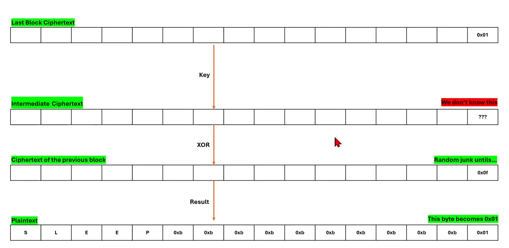
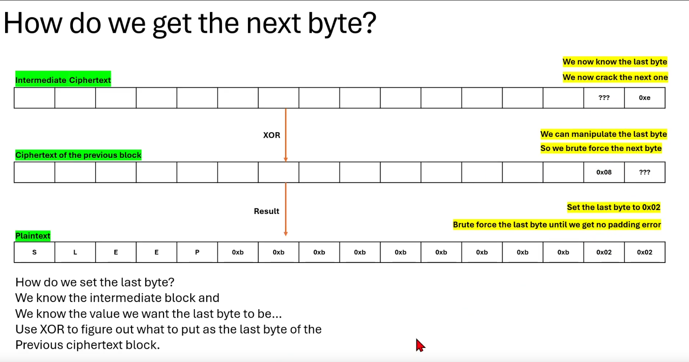

The idea is to decrypt the intermediate block character by character, and then xor the intermediate block with the previous ciphertext to get the plaintext.

- loop over the blocks of ciphertext backwards in `range(n-1, -1)`
  - only send `blocks[i:i+2]` (or `blocks[:i+2]`) to the server, because we need the padding to affect the current block (only 2 ciphertext blocks: the current one + the next block are used to decrypt one plaintext block)

- loop over the bytes of the block backwards in `range(15, -1)`
- loop over all possible byte values and see if the padding is correct (i.e. the last byte is `0x01`, the last two bytes are `0x02`, etc.)
  - make sure to check that the character is not the same as the character in the original block at the first iteration
  - this is because we already know that the original block is valid
- if it is, then calculate the intermediate value by xoring the byte with the padding value

- then, set all the indexes after the current index to the next padding value (i.e. if the current padding value is `0x02`, set every byte after the guessed byte to the `0x03 ^ intermediate value`)
  - this is done so that the padding is correct for the next byte
  - for example, if we trying to get the second last byte, then we need to set the last byte to `0x02`, so the padding is correct
  - we just calculated the intermediate value, so we can set the last byte to `0x02 ^ intermediate value` (see diagram below)

- once the whole intermediate block is decoded, xor it with the original block to get the plaintext
- after decrypting the intermediate block, xor it with the desired plaintext to get new bytes
- then, set those new bytes as the ciphertext block, so it decrypts to the desired plaintext
- `intermediate ^ desired = new-bytes`
- `ciphertext-block = new-bytes`
- in server: `intermediate xor new-bytes = desired`

This video explains it in more detail:
https://www.youtube.com/watch?v=hhFdZnV0UBQ
