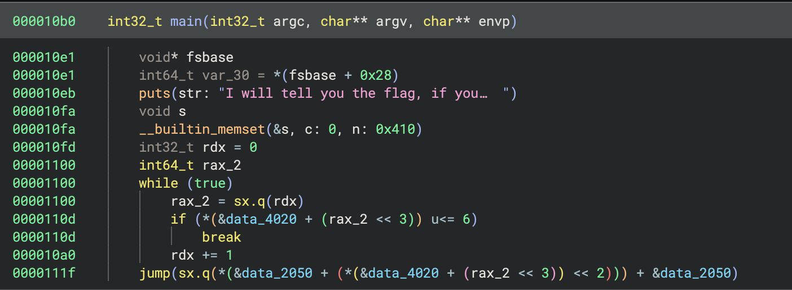
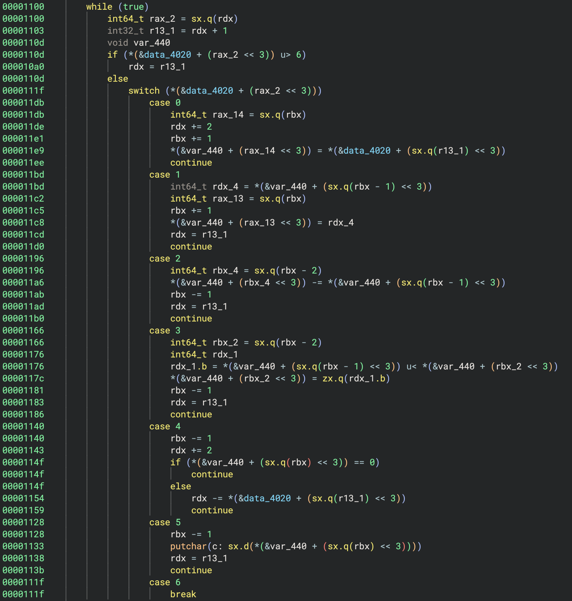

# Writeup

Running the binary outputs the message

```
I will tell you the flag, if you don't mind waiting a few moments...
```

then it seems to hang forever.

The main function looks like:



We can guess that `data_2050` is a jump table. if we fix this for the decompiler, the loop now looks like:



This looks like a pretty simple virtual machine.

The following properties can be determined:

- `rdx` is the instruction pointer
- `data_4020` is the bytecode
- `var_440` is the stack
- `rbx` is the stack pointer

The instruction set is:

| Opcode | Instruction       |
| ------ | ----------------- |
| 0      | push              |
| 1      | push top of stack |
| 2      | sub               |
| 3      | gt                |
| 4      | jump if true      |
| 5      | putchar           |
| 6      | ret               |

Following the VM's execution for a while, we notice that it is repeatedly executing what appears to be a loop, starting at the 2nd instruction and looping back on the 7th instruction.

Either by writing a decompiler, or manually decompiling these instructions from the bytecode, we obtain the disassembly:

```
0x0:    push 0xcffb289af4b1d1
0x2:    push 0x83
0x4:    sub
0x5:    push_top
0x6:    push 0x83
0x8:    gt
0x9:    jmp_if_true 0x2
0x11:   putchar
```

So this takes the value `0xcffb289af4b1d1`, decreases it by `0x83` and checks if the result is greater than `0x83`. If it is it continues the loop and decreases again, otherwise it prints out the result as a character.

Clearly this is the source of the inefficiency, as it will take `0xcffb289af4b1d1 / 0x83 = 446,881,465,619,060` iterations before it completes. However if we think about what will be printed at the end, it is actually just `0xcffb289af4b1d1 % 0x83 = 117`, which is the character `u`.

This pattern repeats for the rest of the disassembly, so we can either just manually repeat this process, or make a script to do it:

```py
import struct

data = bytes.fromhex('0000000000000000d1b1f...')
bytecode = struct.unpack('265Q', data)

flag_chars = []

for i in range(0, len(bytecode) - 1, 12):
    dividend = bytecode[i + 1]
    divisor = bytecode[i + 3]
    remainder = dividend % divisor
    flag_chars.append(chr(remainder))

flag = ''.join(flag_chars)
print(flag)
```

Which gives the flag `uoftctf{vmr00m_vmr00m}`.
